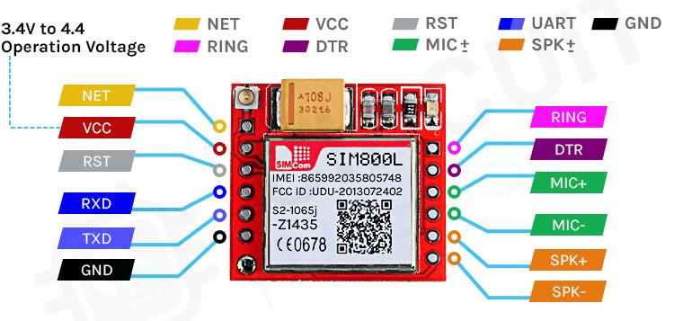
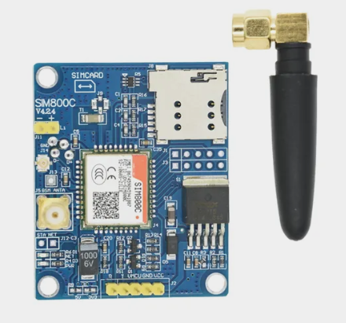
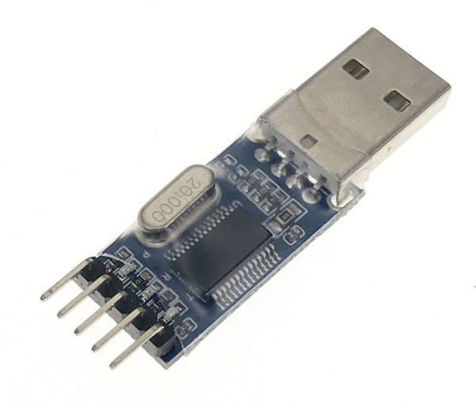
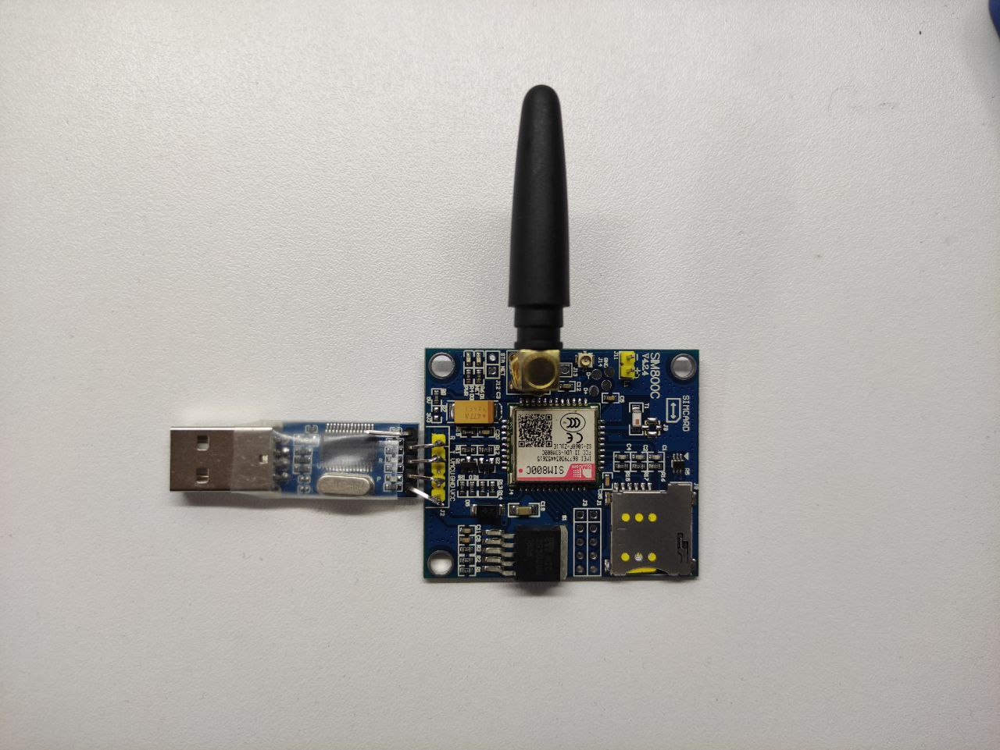
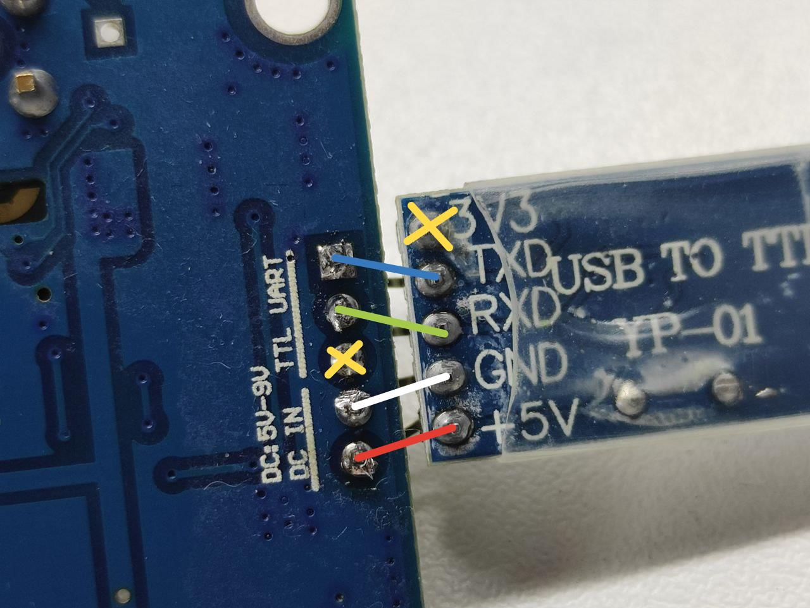
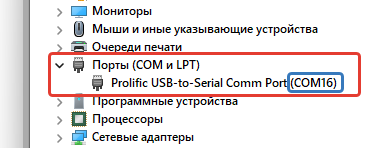

# <h1 align = "center">Легкая работа с модемами SIM800 Series</h1>

Python пакет для работы с SIM800 X - Серией модемов. 
Отправка смс в формате PDU (Русские символы).
Запрос данных.
Отправка AT комманд с получением ответов и обработкой ошибок
Работа через serial COM порт.


### Модемов Sim800 представлено на рынке очень много, в разных вариациях и на разный вкус.
#### Вот один из примеров с распиновкой
 

<h2 align = "left">Где купить? Вот несколько примеров > с алиэкспресс📷:</h2>

Название  | Ссылка на товар        | Инфо
-------------- | ---------------| ------------------------------
Модуль макетной платы SIM800C GSM/GPRS            | [Купить](https://aliexpress.ru/item/1005005124792326.html?sku_id=12000031756855359&spm=a2g2w.productlist.search_results.14.534c4aa6xgiFlD) | Лично покупал у этого продавца *(И будем использовать в проекте именно его)
Модуль макетной платы SIM800C GSM/GPRS | [Купить]() | Лично покупал у этого продавца 
Преобразователь интерфейса USB to TTL | [Купить]()             | Лично покупал у этого продавца 
   

## Datasheet (Инструкция)
- [SIM800 AT Command (Описание комманд)](./datasheet/sim800_series_at_command_manual_v1.01_en.pdf)
- [SIM800 Hardware Design (Схематика)](./datasheet/SIM800_Hardware%20Design_V1.08_en.pdf)


## FAQ (Начнемс;) )
<hr>

### 1. Модули, которые нам понадобятся

1.1 Модуль макетной платы SIM800C GSM/GPRS 
<br>
Специально выбрал именно эту плату, потому что ее можно питать от TTL преобразователя и не парится. Модули SIM800 привередливы к питанию. На этой макетной плате уже установлен стабилизатор напряжения на микросхема mic 29302wu входное напряжение 5-9 Вольт, но все же если плата будет использоваться так сказать на продакшн, то лучше позаботится о стороннем питании, но об этом ниже в описании.


<hr>
1.2 Преобразователь интерфейса USB to TTL<br>
Ссылка для покупки выше. Преобразователь построен на базе микросхемы PL2303HX. <br>Что бы у нас появился и заработал COM порт в системе, нжно установить драйвера<br>

- [Драйвер для windows 64x](./drivers/pl2303win.zip)
- [Дрыйвер для Mac OS](./drivers/pl2303macosx.zip)
<br>Инструкция по установке драйвера НАХОДИТСЯ В АРХИВЕ 

<br>

<hr>


### 2. Давайте подключим и соберем нашу схему:

У меня это выглядит вот таким костыльным способом, для тестирования.<br>
 * 
<br>
Схема расключения. <br>
<br>


<hr>
После установки драйвера и подключения всей этой конструкции к ПК, у вас появится порт с номером
<br>



<hr>

### 3. Использование пакета
 
 - Представим что у вас уже установлен Python последней версии, и GIT ;)
 - Установка:
 
 ```
 git clone https://github.com/715kg/sim800.git
 ```
 
 - Открываем файл main.py
 ```Python
from Sim800.modem import sim800

# Регистрируем наш модем
# "Номер порта" "Скорость билда 115200" "Таймаут соединения 2 секунды"
modem = sim800('COM16', 115200, 2) 

# Отправляем смс, номер вводится без (+)
sms = modem.sms_send('79920000000', 'Привет мой друг!')

# Ответ от модема True если смс отправилось и False если произошла ошибка
if sms:
    print('SMS Успешно отправлено')
else:
    print('Ошибка отправки SMS')

# Обязательно закрываем соединение с COM портом
modem.close()
```
<br>

- Вы можете получить некоторую информацию

```Python

from Sim800.modem import sim800

# Регистрируем наш модем
# "Номер порта" "Скорость билда 115200" "Таймаут соединения 2 секунды"
modem = sim800('COM16', 115200, 2) 

# Получаем ревизию модуля
r1 = modem.get_revision()
>> Reviion:1324238B08SIM800C24_BT

# Получаем идентификатор модуля
r2 = modem.get_identification()
>> SIMCOM_SIM800C

# Получаем возможности модуля модуля
r2 = modem.get_possibilities()
>> +GCAP: +CGSM

# Получаем imei модуля
r2 = modem.get_imei()
>> 8677930344*****

# Информация об операторе
r2 = modem.get_info_operators()
>> MOTIV

# Доступные операторы (Не рекомендуем использовать эту функцию, так как модем отвечает на нее очень долго, а иногда выбивает ошибку)
r2 = modem.get_available_operators()
>> +COPS: (2,"MOTIV","MOTIV","25020"),(3,"MTS","MTS","25001"),(3,"25035","25035","25035"),(3,"Bee Line GSM","BeeLine","25099"),(3,"MegaFon","MegaFon","25002"),,(0-4),(0-2)

# Состояние модуля 
"""
0 – готов к работе
2 – неизвестно
3 – входящий звонок
4 – голосовое соединение

:return: String
"""
r2 = modem.get_module_stat()
>> 0

# Регистрация в сети 
"""
Первый параметр:
0 – нет кода регистрации сети
1 – есть код регистрации сети
2 – есть код регистрации сети + доп параметры

Второй параметр:
0 – не зарегистрирован, поиска сети нет
1 – зарегистрирован, домашняя сеть
2 – не зарегистрирован, идёт поиск новой сети
3 – регистрация отклонена
4 – неизвестно
5 – роуминг
        
:return: String
"""
r2 = modem.get_network_registration_type()
>> 0,1

# Уровень сигнала
"""
Уровень сигнала:
0     | -115 дБл и меньше
1     | -112 дБл
2-30  | -110..-54 дБл
31    | -52 дБл и сильнее
99    | нет сигнала.
        
:return: String
"""
r2 = modem.get_signal_level()
>> 25,0

# Напряжение модуля
"""
Монитор напряжения питания модуля
Первый параметр:
0 – не заряжается
1 – заряжается
2 – зарядка окончена

Второй параметр:
1-100 % — уровень заряда батареи

Третий параметр:
Напряжение питание модуля (VBAT), мВ

:return: String
"""
r2 = modem.get_supply_voltage()
>> 0,66,3933


# Обязательно закрываем соединение с COM портом
modem.close()
```


- Для отправки АТ комманд модулю, используйте функцию send_command_at()
- Весь список команд можно найти в документации (Datasheet) о модеме, закрепленном выше.

```Python
from Sim800.modem import sim800

# Регистрируем наш модем
# "Номер порта" "Скорость билда 115200" "Таймаут соединения 2 секунды"
modem = sim800('COM16', 115200, 2) 

# Отправка АТ комманд модему
command = modem.send_command_at("ATH")


# Ответ от модема - Вы получите OK если модем принял команду и False если произошла ошибка
print(command)
>> OKH


# Обязательно закрываем соединение с COM портом
modem.close()
```
